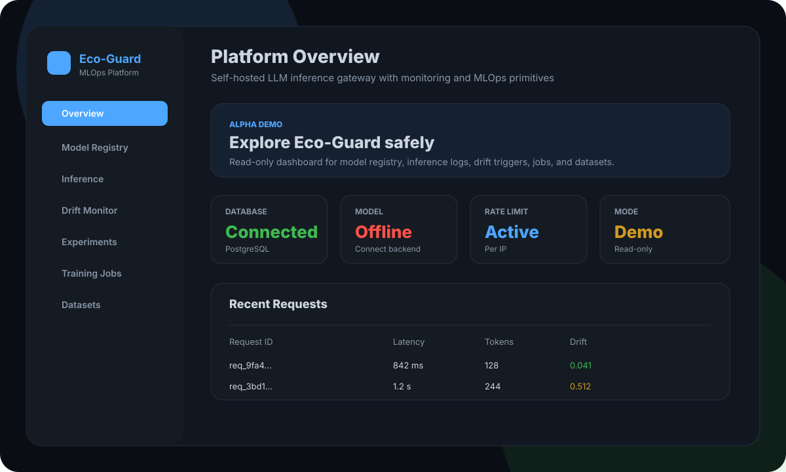

<p align="center">
  
  
  
  
  
</p>

<h1 align="center">Eco-Guard</h1>
<p align="center"><strong>Alpha self-hosted LLM inference gateway with monitoring and MLOps primitives.</strong></p>

> **Status: alpha.** Eco-Guard is a working showcase and early open-source project. It is useful for local experiments, demos, and learning, but it is not yet a finished production MLOps platform.



## What It Is

Eco-Guard is a self-hosted control plane for serving and observing LLM inference. It combines a FastAPI gateway, Vue dashboard, PostgreSQL-backed logs, Prometheus metrics, model registry primitives, drift tracking, datasets, jobs, and experiment views.

The goal is to become a practical local/self-hosted alternative for teams that want visibility around LLM inference without starting from a blank FastAPI app.

## What Works Today

- REST inference endpoint: `POST /api/v1/predict`
- SSE streaming endpoint: `POST /api/v1/predict/stream`
- Backend abstraction for local `llama-cpp` and OpenAI-compatible servers such as Ollama, vLLM, and TGI
- Request logging with latency, token count, output, and drift score
- Health, readiness, metrics, and benchmark endpoints
- JWT login, API-key header auth, rate limiting, request timeout, and demo read-only mode
- Model registry APIs for register, promote, deploy, and rollback metadata
- Dataset creation from inference logs
- Training job and experiment tracking metadata
- Drift-trigger records and acknowledgement APIs
- Vue dashboard pages for overview, models, inference logs, drift triggers, jobs, datasets, and experiments
- Docker Compose, Render, Vercel frontend demo config, Alembic migrations, tests, and docs

## What Is Not Finished Yet

- DB-backed users, password hashing, invitations, and real multi-user workspaces
- Hashed API keys with scopes, expiration, ownership, and usage tracking
- Real training execution workers; current jobs are lifecycle metadata
- Redis-backed distributed rate limiting and queues
- Production-grade canary/blue-green traffic router
- Full privacy controls for prompt/output retention and redaction
- Complete polished UI workflows for every backend API

## Quick Start

Local development uses SQLite fallback when PostgreSQL is not available:

```bash
uv sync --group dev
uv run uvicorn src.main:app --host 0.0.0.0 --port 8000 --reload
```

Open:

```text
http://localhost:8000/docs
http://localhost:8000/dashboard
```

Default local credentials are only for development:

```text
admin / admin
```

## Docker Compose

Docker Compose runs the API and PostgreSQL with production validation enabled:

```bash
export ECOGUARD_DOCKER_JWT_SECRET="replace-with-a-long-random-secret-at-least-32-chars"
export ECOGUARD_DOCKER_ADMIN_USERNAME="admin"
export ECOGUARD_DOCKER_ADMIN_PASSWORD="replace-with-a-real-password"
docker compose up --build
```

The model is optional. Without a model file, health will show the database as connected and the model as offline. To run local GGUF inference, mount a model into `./models/` and set `MODEL_PATH`.

## Demo Deployment

Recommended public demo setup:

- Host the Vue frontend on Vercel.
- Host the FastAPI backend on Render/Fly/Railway/VPS.
- Set `VITE_API_BASE_URL` in Vercel to the backend URL.
- Set backend `DEMO_MODE=true`, `DEMO_READ_ONLY=true`, `API_KEYS=[]`, and a restricted `CORS_ORIGINS` value.
- Use seeded/sample data for the public demo.

Vercel is configured as frontend-only. The FastAPI backend should not be deployed as Vercel serverless functions because this app uses startup lifecycle tasks, WebSockets, database migrations, and model/backend connections.

## API Example

```bash
curl -X POST http://localhost:8000/api/v1/predict \
  -H "Authorization: Bearer $TOKEN" \
  -H "Content-Type: application/json" \
  -d '{"prompt":"Explain vector databases in one paragraph","max_tokens":128}'
```

## Architecture

```text
Vue Dashboard / API Clients
        |
FastAPI REST + SSE + WebSocket
        |
Auth, rate limit, timeout, logging, metrics
        |
Inference service, drift detector, cache, alerting
        |
Model backend abstraction: llama-cpp / Ollama / vLLM / TGI / OpenAI-compatible
        |
PostgreSQL in production, SQLite for local development
```

## Roadmap

- Replace env-admin auth with DB-backed users and hashed passwords
- Add workspaces, invites, roles, and scoped resources
- Add hashed API keys with scopes, expiration, and usage analytics
- Add Redis-backed rate limiting, cache, queues, and worker processes
- Add real training/retraining worker execution with logs and artifacts
- Add production deployment routing for canary, A/B, and blue-green model rollout
- Add prompt/output redaction and retention policies
- Add seed data and a public read-only demo workspace
- Improve dashboard workflows for registry, datasets, evaluations, and model routing

## Development

```bash
make sync          # install deps
make run           # start server
make test          # run tests
make lint          # ruff check
make format        # ruff format
make typecheck     # mypy
make check         # lint + typecheck + test
```

## Project Structure

```text
src/              FastAPI app, services, core middleware, MLOps modules
frontend/         Vue 3 + Vite dashboard
tests/            Backend tests
alembic/          Database migrations
docs/             Documentation and media
monitoring/       Prometheus alerts and Grafana dashboard
k8s/, helm/       Kubernetes deployment assets
```

## License

MIT
